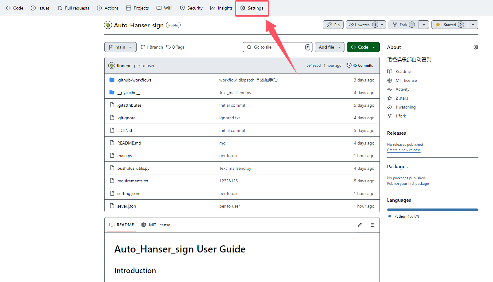

# Auto_sign_mao

---

教程Notion原址：

[https://linenene.notion.site/Auto_sign_mao-1195b4e28554804783a5da3950fc2f69?pvs=4](https://www.notion.so/Auto_sign_mao-1195b4e28554804783a5da3950fc2f69?pvs=21)

# A. Fork这个项目；

---

1. **Fork这个项目（记得取消 only main选项）；**
2. **在你fork的项目中开始之后的步骤；**
3. **在你的项目中启用Aciton（自己搜索）；**

# B. 创建一个”密钥”；

---

## **点击项目顶部栏“setting”**



## **点击“Secrets and variables”，“Action”**


## **创建一个新的密钥，并命名为“SETTINGS_JSON”**


## **在下列代码中，填写你的相关信息：**

        **分别是，你的用户名，密码，你的邮箱（会使用这个邮箱通知你），以及是否使用邮箱通知（也可以选用PushPlus）默认就好。**

**将这段代码填写进“SETTINGS_JSON”中保存即可**

```json
{
    "Set": {
        "NAME": "XXX", 
        "PASSWORD": "XXXX",	
        "TO_EMAIL": "xx@XXX.com",
        "USE_EMAIL": true
    }                                 
}
```

# C. 第一次测试；

---

**tips：**

**默认为每天凌晨两点自动启动，你也可以通过手动触发来测试；**


***再次，如果你在使用中遇到任何问题，请联系我***

***qq：2691234891***